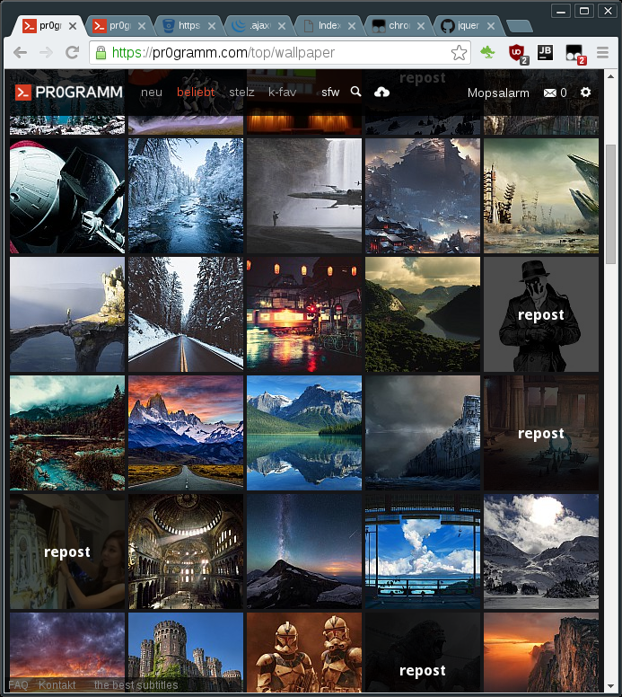

# Reposts hervorheben

Dieses Skript hebt *reposts* im Feed hervor, genau wie es in der [pr0gramm navigator](https://mopsalarm.github.io/Pr0)
Android App schon lange zu sehen ist.

## Installation

Das Userscript ist hier zu finden: https://github.com/mopsalarm/pr0gramm-reposts-userscript/raw/master/pr0gramm-reposts.user.js.

Du benötigst ein UserScript Addon für deinen Browser.
* **Chrome**: [Tampermonkey](https://chrome.google.com/webstore/detail/tampermonkey/dhdgffkkebhmkfjojejmpbldmpobfkfo?hl=de)
* **Firefox**: [Greasemonkey](https://addons.mozilla.org/en-us/firefox/addon/greasemonkey/)
* **Opera**: [Violent monkey](https://addons.opera.com/en/extensions/details/violent-monkey/)

Hast du die Erweiterung installiert, kannst du einfach den obrigen Link zum [UserScript](https://github.com/mopsalarm/pr0gramm-reposts-userscript/raw/master/pr0gramm-reposts.user.js) anklicken.

## Screenshot

